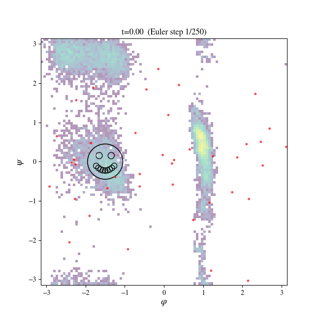
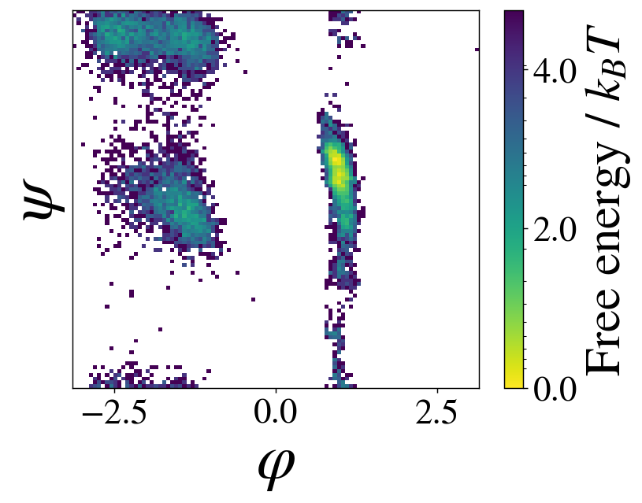
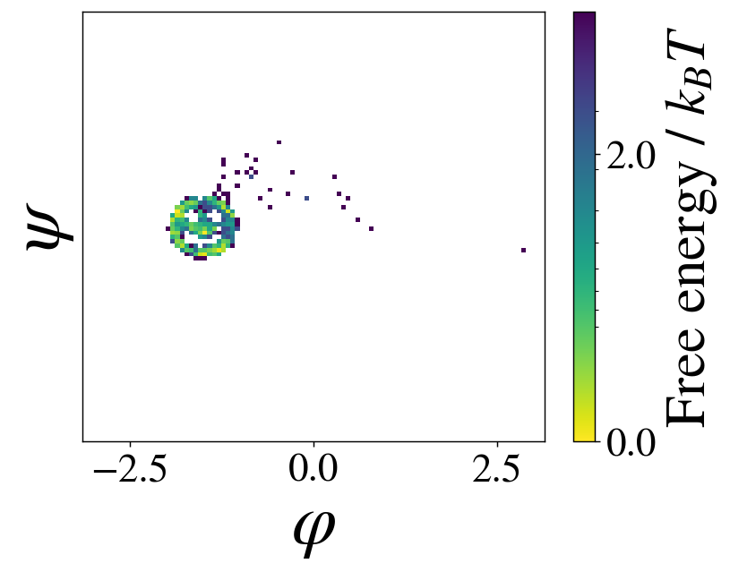

# Transferable Samplers

> **This is a fork** of [transferable-samplers](https://github.com/transferable-samplers/transferable-samplers) by Charlie B. Tan, Majdi Hassan, Leon Klein, Saifuddin Syed, Dominique Beaini, Michael M. Bronstein, Alexander Tong, and Kirill Neklyudov, licensed under the MIT License with some third-party components under separate — in places non-commercial — licenses (see [NOTICE](NOTICE)). The base codebase is unchanged; this fork adds a [`guidance`](src/transferable_samplers/guidance/) module and accompanying experiments by [Joran Wendebourg](https://github.com/jovako), described below.

A codebase for **sampling the Boltzmann density of molecular systems**, with a focus on transferable methods that generalise to unseen systems at inference time.

For further documentation, see the [docs](https://transferable-samplers.github.io/transferable-samplers/#/)!

## Guidance: a proof-of-concept guided Boltzmann Generator

This fork's contribution is **inference-time guidance**: steering a trained flow-matching Boltzmann Generator toward samples that satisfy a user-supplied condition — a region of collective-variable space, a rare conformational state, an arbitrary shape drawn in that space — **without retraining the model**. It's a proof of concept, built on top of this codebase's ECNF++ flow-matching models and demonstrated on alanine dipeptide (Ace-A-Nme).

The core addition is a **guided Euler integrator** ([`src/transferable_samplers/guidance/euler_density_integrator.py`](src/transferable_samplers/guidance/euler_density_integrator.py)). The stock sampler integrates the flow ODE with an adaptive-step `dopri5` solver, which has no notion of a per-step control input, so guidance instead needs a fixed-step Euler integrator that can optimize a control vector at every step while still reporting a correct sample density. The per-step control optimization + teleport recursion follows the variational-control guidance algorithm of Pandey et al., [*Variational Control for Guidance in Diffusion Models*](https://arxiv.org/abs/2502.03686v2) (arXiv:2502.03686v2), and its reference implementation [czi-ai/oc-guidance](https://github.com/czi-ai/oc-guidance), respectively the implementation in [*Efficient Sampling from Invariant Sets for Model Validation*](https://arxiv.org/abs/2603.21782). This module is a from-scratch reimplementation on top of ECNF++, adding an **exact log-density** for the guided trajectory (rather than an approximation), so guided samples can still be correctly reweighted (e.g. via self-normalized importance sampling).

See [docs/guidance.md](docs/guidance.md) for the full write-up, or walk through the module interactively in [`tests/guidance/guidance_tutorial.ipynb`](tests/guidance/guidance_tutorial.ipynb), which:
- draws an unguided baseline for comparison against every guided result,
- composes a cost function out of the cost-shaping primitives in `guidance/costs.py` — a "smiley face" target region in `(φ, ψ)` dihedral space, attracting samples into the face and repelling them out of the eyes and mouth,
- runs guided sampling under that cost and compares it against the unguided and rejection-sampling baselines,
- animates a batch of guided trajectories collapsing onto the target as a GIF, and
- verifies the exact-density tracking against the stock `dopri5` solver.

<p align="center">
  
</p>

Before vs. after guidance, in terms of the actual sampled `(φ, ψ)` free-energy density:

<p align="center">
  
  
</p>

## Quickstart

```bash
# Clone repo
git clone https://github.com/transferable-samplers/transferable-samplers.git
cd transferable-samplers

# Create and activate a virtual environment
uv venv .venv --python=3.11
source .venv/bin/activate

# Install in editable mode
uv pip install -e .

# Install runtime dependencies
uv pip install -r requirements.txt
```

Then run your first experiment!
```bash
uv run python -m transferable_samplers.eval experiment=transferable/eval/prose_up_to_8aa_snis
```

> You must also populate `.env.example` and save as `.env` (sets `SCRATCH_DIR`).
> **Optional:** Flash Attention (for TarFlow methods) must be installed separately, see the note at the bottom of `requirements.txt`.

For full usage including datasets, model weights, training, and fine-tuning, see [Usage](https://transferable-samplers.github.io/transferable-samplers/#/usage). For development setup, tooling, and tests, see [Contributing](https://transferable-samplers.github.io/transferable-samplers/#/contributing).

## Implemented Papers

This codebase is the official implementation of:

**Amortized Sampling with Transferable Normalizing Flows**
[](https://neurips.cc/virtual/2025/loc/san-diego/poster/118702)
[](https://arxiv.org/abs/2508.18175v4)

**Scalable Equilibrium Sampling with Sequential Boltzmann Generators**
[](https://icml.cc/virtual/2025/poster/45137)
[](https://arxiv.org/abs/2502.18462)

For details on reproducing paper results see [Paper Reproduction](https://transferable-samplers.github.io/transferable-samplers/#/paper-reproduction).

---

We additionally provide baseline implementations of:

**Transferable Boltzmann Generators**
[](https://proceedings.neurips.cc/paper_files/paper/2024/hash/5035a409f5798e188079e236f437e522-Abstract-Conference.html)
[](https://arxiv.org/abs/2406.14426)

More to come soon! 🚀

## Citation

If you use this codebase, please cite:
```bibtex
@inproceedings{
tan2025amortized,
title={Amortized Sampling with Transferable Normalizing Flows},
author={Charlie B. Tan and Majdi Hassan and Leon Klein and Saifuddin Syed and Dominique Beaini and Michael M. Bronstein and Alexander Tong and Kirill Neklyudov},
booktitle={The Thirty-ninth Annual Conference on Neural Information Processing Systems},
year={2025},
url={https://openreview.net/forum?id=JenfC3ovzU}
}
```

### Citing this fork

The [`guidance`](src/transferable_samplers/guidance/) module and the experiments in this fork are engineering work exploring inference-time guidance for Boltzmann Generators — a proof of concept, not a paper, so there's no citable reference of its own. If it's useful to you, a link back to this repository or a mention of [Joran Wendebourg](https://github.com/jovako) is appreciated. For the methods it builds on:
- the base sampler and training code: cite *Amortized Sampling with Transferable Normalizing Flows* above;
- the guidance algorithm: Pandey et al., [*Variational Control for Guidance in Diffusion Models*](https://arxiv.org/abs/2502.03686v2) (arXiv:2502.03686v2), and its reference implementation [czi-ai/oc-guidance](https://github.com/czi-ai/oc-guidance).

## Acknowledgements

We thank HuggingFace for hosting the [ManyPeptidesMD](https://huggingface.co/datasets/transferable-samplers/many-peptides-md) dataset!

## License

The core of this repository is licensed under the MIT License (see [LICENSE](https://github.com/transferable-samplers/transferable-samplers/blob/main/LICENSE)).
Some files include adaptations of third-party code under other licenses (Apple, NVIDIA, Klein & Noé).
In some cases, these third-party licenses are **non-commercial**.
See [NOTICE](https://github.com/transferable-samplers/transferable-samplers/blob/main/NOTICE) for details.
