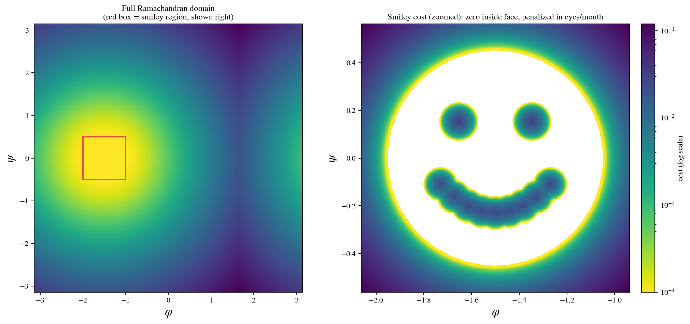
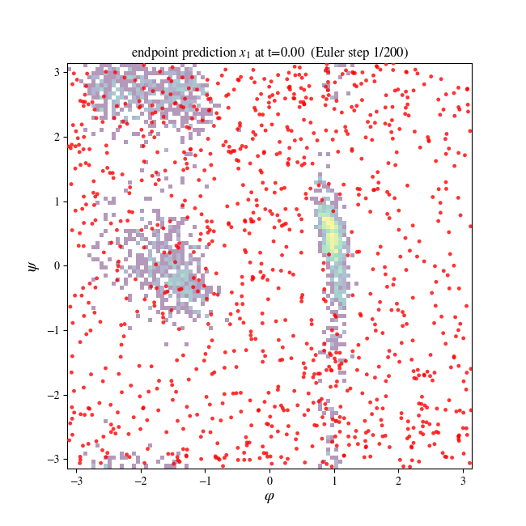
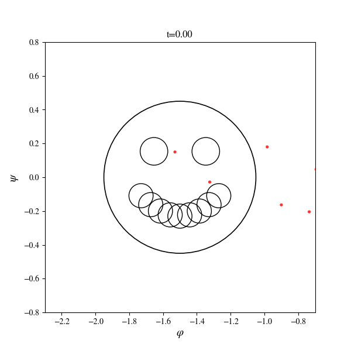
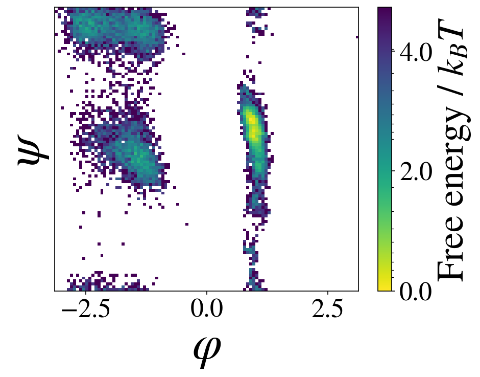
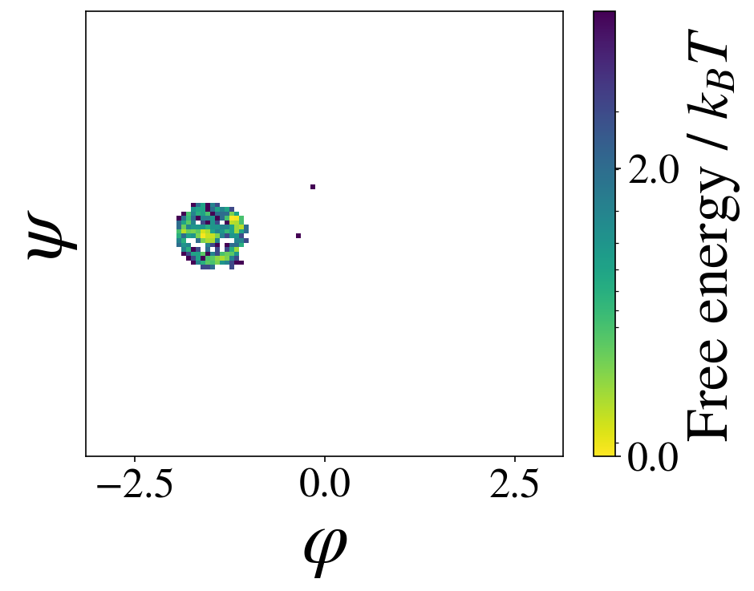
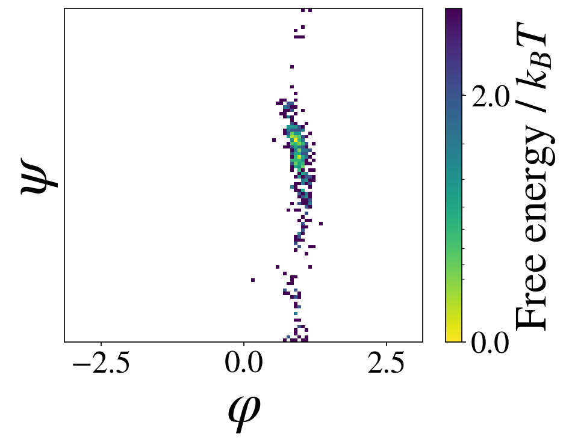

# Guidance

Inference-time guidance steers a trained flow-matching sampler toward samples that satisfy some target condition — a region of collective-variable space, a rare conformational state, a shape you just made up — **without retraining the model**. Each Euler step's endpoint is nudged by a small control vector fit on the fly to reduce a user-supplied cost, then the trajectory continues from the nudged point.

The guidance algorithm here (the per-step control optimization + teleport recursion) follows [czi-ai/oc-guidance](https://github.com/czi-ai/oc-guidance). This module is a from-scratch reimplementation on top of this codebase's ECNF++ flow-matching models, adding an **exact log-density** for the guided trajectory (rather than an approximation), so guided samples can still be correctly reweighted (e.g. via SNIS).

## Why a custom integrator

The stock sampler integrates the flow ODE with an adaptive-step `dopri5` solver, which has no notion of a per-step control input. Guidance instead needs a **fixed-step Euler integrator** so a control vector can be optimized at every step:

```
u          = n_inner steps of L2-normalized gradient descent, minimizing
             a terminal cost evaluated on the endpoint estimate
cxt        = x + gamma * u          # control shift teleported into the trajectory
x_next     = cxt + dt * net(t, cxt) # Euler step taken FROM the perturbed point
```

`gamma=0` (or `n_inner=0`) exactly recovers plain unguided Euler, which lets the integrator itself be validated against the stock `dopri5` solver independent of guidance (see [Verifying the integrator](#verifying-the-integrator) below).

## Module layout

- **`euler_density_integrator.py`** — the guided Euler integrator itself:
  - `make_guided_euler_step` builds one differentiable step (inner control loop + teleport + velocity).
  - `guided_euler_exact` runs the full `t=0 → t=1` trajectory, optionally accumulating the **exact** `log|det(dx_next/dx)|` via per-coordinate autograd (not an approximation), so the returned density is correct rather than a first-order surrogate.
  - `generate_proposal_guided_euler` is the batteries-included entry point: samples from the model's prior, runs the guided trajectory, and returns `(x, -log q, valid)` — a drop-in-shaped replacement for a standard `generate_proposal` call.
  - `check_unguided_consistency` turns guidance off and checks the result converges to the stock `dopri5` log-density as the step count grows — the correctness test to run before trusting any guided number.
- **`costs.py`** — small composable cost-shaping helpers (`one_sided_quadratic_penalty`, `box_quadratic_penalty`, `within_radius_penalty`, `repel_within_radius_penalty`, `torus_distance`, ...) for turning an observable value into a per-sample terminal cost.
- **`observables.py`** — a batched, differentiable reimplementation of dihedral angles (phi/psi/omega) in pure PyTorch, since the evaluation-side `mdtraj` computation isn't differentiable and guidance needs gradients of the observable w.r.t. atom positions.

## Usage

```python
from functools import partial
from transferable_samplers.guidance.costs import torus_distance, within_radius_penalty
from transferable_samplers.guidance.euler_density_integrator import generate_proposal_guided_euler
from transferable_samplers.guidance.observables import dihedrals, get_dihedral_atom_indices

phi_idx = get_dihedral_atom_indices(topology, kind="phi")
psi_idx = get_dihedral_atom_indices(topology, kind="psi")
TARGET_PHI, TARGET_PSI, RADIUS = -1.5, 0.0, 0.5

def terminal_cost(x1_flat, t):
    # x1_flat is a single flattened sample (num_atoms*3,); vmapped over the batch internally.
    x1 = x1_flat.view(1, -1, 3)
    phi = dihedrals(x1, phi_idx).squeeze(-1)
    psi = dihedrals(x1, psi_idx).squeeze(-1)
    dist = torus_distance(phi, psi, TARGET_PHI, TARGET_PSI)
    return within_radius_penalty(dist, RADIUS).squeeze()

x, neg_logq, valid = generate_proposal_guided_euler(
    model, num_samples=128, num_atoms=num_atoms,
    terminal_cost=lambda x1, t: 20.0 * terminal_cost(x1, t),  # cost weight
    gamma=1.0, alpha=0.1, n_inner=1, n_steps=250,
    device=device, track_density=True, raise_on_orientation_failure=False,
)
x, neg_logq = x[valid], neg_logq[valid]  # drop samples that hit a degenerate (non-orientation-preserving) step
```

`track_density=False` skips the exact-density Jacobian (cheap, for hyperparameter search); turn it on to get a correct `log q` for a winning configuration, e.g. for SNIS reweighting.

## Verifying the integrator

Guidance introduces a lot of moving parts (a differentiable inner loop, an exact-Jacobian outer loop, an orientation check). Before trusting any guided density, `check_unguided_consistency` validates the plumbing with guidance switched off:

```python
from transferable_samplers.guidance.euler_density_integrator import check_unguided_consistency

out = check_unguided_consistency(model, z, n_steps_list=(100, 200, 400, 800))
# out[n]["logq_mean"] should converge to out["dopri5"]["logq_mean"] as n grows
```

## Examples

Two guidance objectives, both on alanine dipeptide (Ace-A-Nme), run through this module:

**A shaped target region.** The cost is zero inside a smiley-face-shaped region of (phi, psi) space and grows quadratically outside the face and inside the eyes/mouth (a repulsive penalty carving holes out of an otherwise flat basin):

<p align="center"></p>

Sampling under this cost pulls endpoint predictions from the full Ramachandran domain into the target shape over the course of the guided trajectory:

<p align="center">


</p>

Before vs. after, in terms of the actual sampled (phi, psi) density:

<p align="center">


</p>

**Biasing toward a rare conformational state.** Rather than a toy shape, the same machinery can push mass into a specific, normally rarely-visited basin — here, `phi > 0`, a high-energy region for alanine dipeptide that the unguided model only sparsely covers:

<p align="center"> 0"></p>

More examples, hyperparameter-search scripts, and the scripts used to generate the plots above live under `tests/guidance/`.
